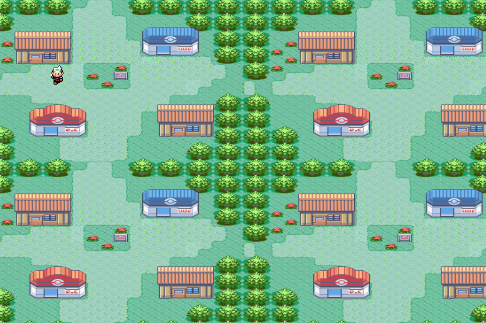
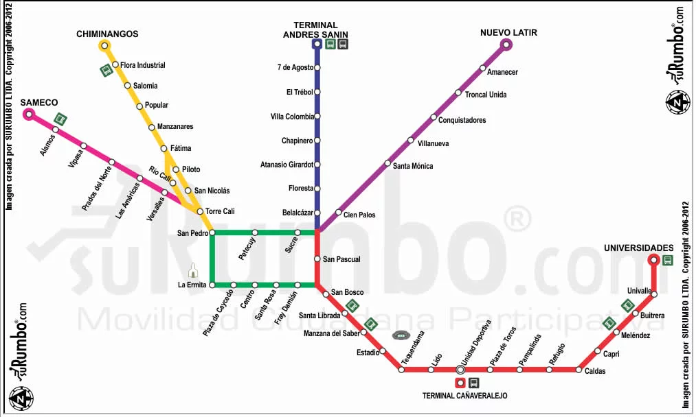

## JavaFX Pokemon
Copy of the famous Pokemon video game made in Java with the JavaFX library. Two cities, fights with wild Pokemon, start screen, save game, highscore table and background music.
- 
- Tags: Java
- Badges:
  - Java [blue]
  - JavaFX [black]
- Buttons:
  - Link [https://github.com/danieljaraba/jfx-pokemon]

## MIO Routes
Back-end API made for select the best route between two stations in the MIO system of Cali city.
- 
- Tags: SpringBoot
- Badges:
  - Java [blue]
  - SpringBoot [green]
- Buttons:
  - Link [https://github.com/danieljaraba/back-mioroutes]

## NextJS Vote System
Simple voting system for the presidencial elections in Colombia. Visualize votes with charts.
- 
- Tags: React
- Badges:
  - JavaScript [darkblue]
  - React [blue]
  - NextJS [red]
  - ChartJS [orange]
- Buttons:
  - Link [https://github.com/danieljaraba/vote-system-nextjs]
